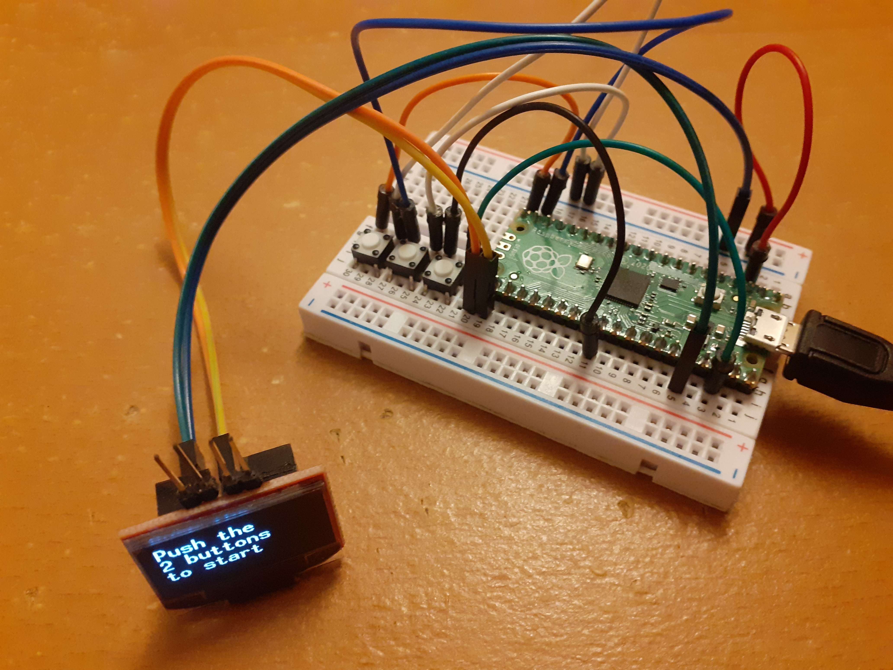
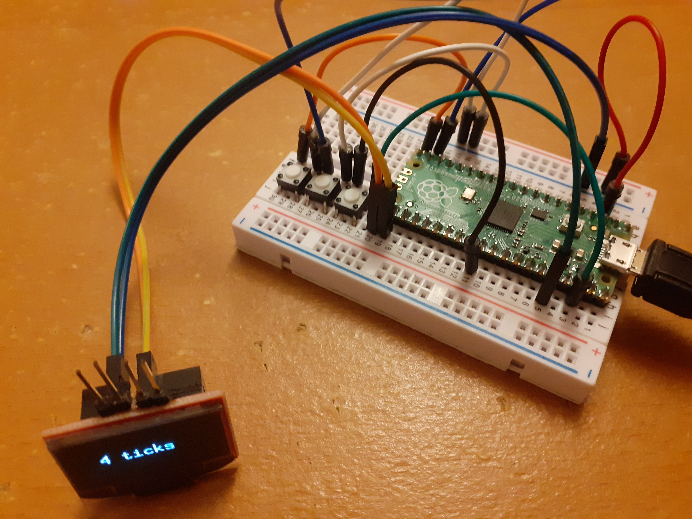

# Tick counter

Project allows you to increment and decrement a counter by pressing 2 different small-tact buttons and show it on a ssd1308 display, these are all connected by a raspberry pico. See pictures beneath to see how it looks in real life.

## Raspberry pico reboot

The button next to the raspberry pico has a function to trigger the run pin on the pico. When this is triggered togheter with the pico board button, and released with the pico on-board button as first and then the other one next to the board it will put the pico in boot mode. The pico will be able to be seen as a disk where you can upload your binary on it, in uf2 file format.

## Contribution

Code is heavily inspired by raspberry pico start project and ssd1308 rust driver.
